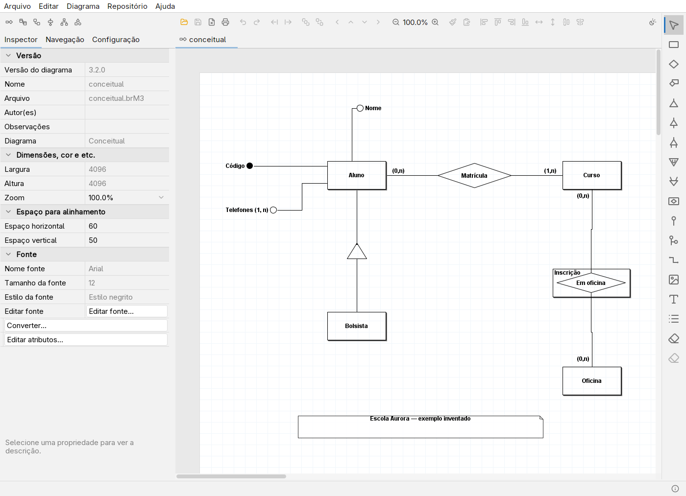
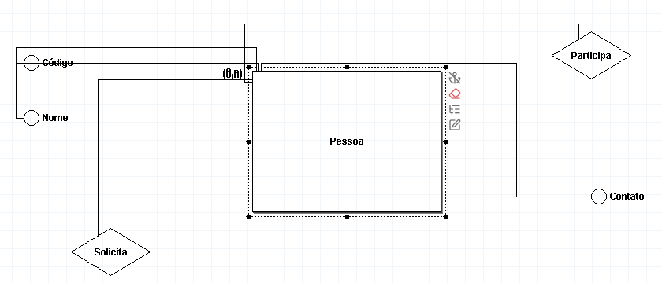
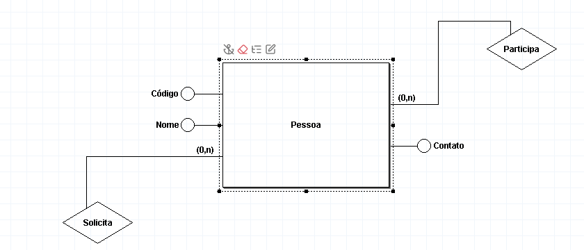
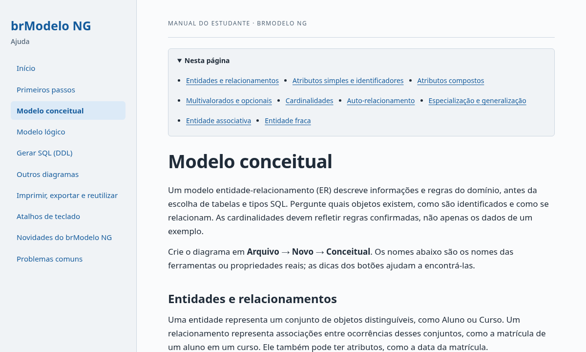
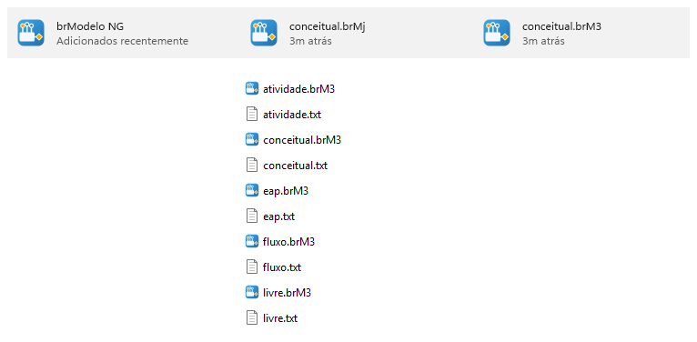
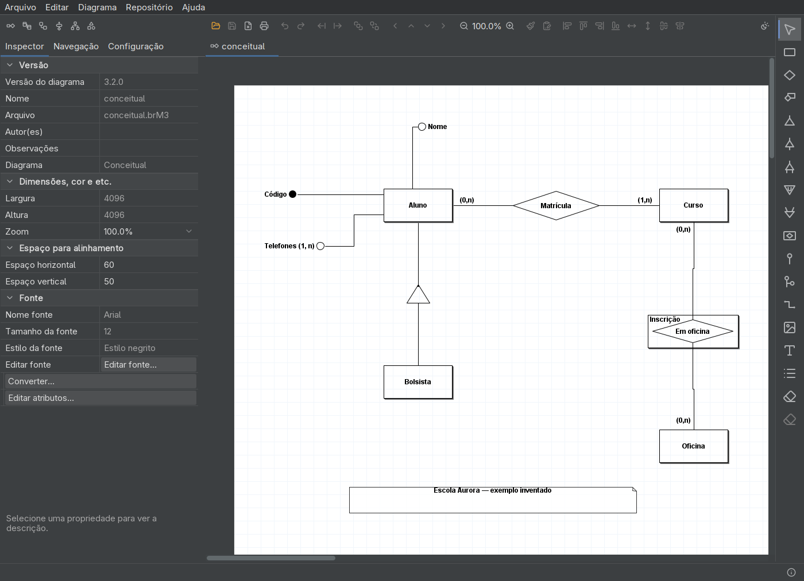
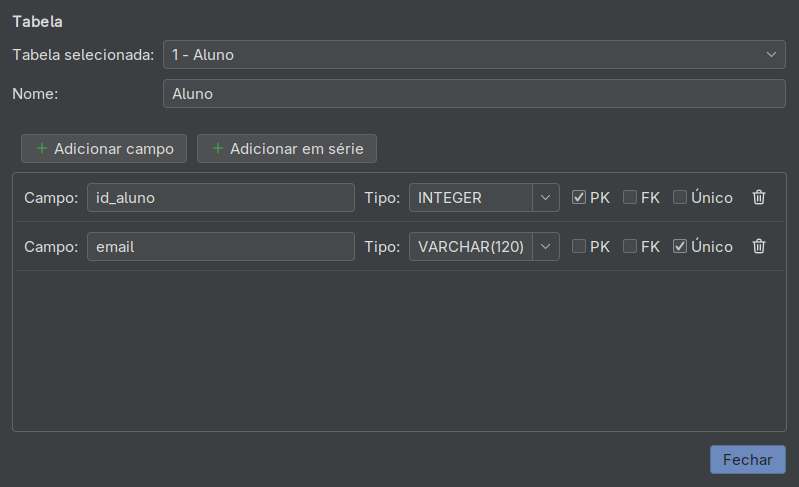
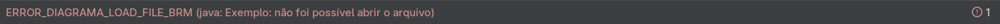

<div align="center">


# brModelo NG

**Modelagem de bancos de dados para aprender e ensinar.**

*O README do projeto original termina com um convite: "Copie, altere, publique."<br>
O brModelo NG nasceu desse convite.*

[](https://github.com/kpagnussat/brModeloNG/releases/latest)
[](https://github.com/kpagnussat/brModeloNG/releases)
[](https://github.com/kpagnussat/brModeloNG/actions/workflows/ci.yml)
[](https://github.com/kpagnussat/brModeloNG/stargazers)
[](LICENSE)

[](https://github.com/kpagnussat/brModeloNG/releases/latest)
[](https://github.com/kpagnussat/brModeloNG/releases/latest)
[](https://github.com/kpagnussat/brModeloNG/releases/latest)
[](BUILDING.md)

**[Baixar](#instalação)** · **[Novidades](#no-dia-a-dia)** · **[Ajuda](#ajuda-completa-no-f1)** · **[Compatibilidade](#compatibilidade-com-o-brmodelo-oficial)** · **[Por dentro](#por-dentro-do-código)** · **[Compilar e contribuir](#código-fonte-e-contribuições)** · **[English](#english)**

</div>

O **brModelo NG** é uma continuação independente do brModelo 3.3.2, a ferramenta
livre de Carlos Henrique Cândido para o ensino de modelagem de bancos de dados.

Você pode criar modelos conceituais e lógicos, converter do conceitual para o
lógico, gerar SQL, exportar imagens e imprimir diagramas. Também estão
disponíveis fluxogramas, diagramas de atividades, estruturas analíticas de
projetos (EAP) e diagramas livres.

<h3 align="center">Preserva o programa e o seu propósito.<br>Melhora o uso em sistemas modernos.</h3>

<p align="center">
  <picture>
    <source media="(prefers-color-scheme: dark)" srcset="docs/img/principal-escuro.png">
    
  </picture>
</p>

<div align="center">

[](https://github.com/kpagnussat/brModeloNG/releases/latest)

Os pacotes para Linux, Windows e macOS já trazem o Java.

</div>

Além da interface renovada, o NG traz **edição mais precisa**, com encaixe na
grade e o comando **Organizar ligações**, **ajuda completa no F1**, que funciona
sem internet, impressão fiel ao diagrama e suporte a diagramas grandes.

O formato **`.brM3` continua sendo o padrão e abre no brModelo oficial**, com
testes que protegem essa compatibilidade. Opcionalmente, os diagramas também
podem ser salvos em JSON (`.brMj`), fácil de revisar no Git.

O NG é um fork **não oficial**, mantido por
[Kristofer Pagnussat](https://github.com/kpagnussat), que preserva os créditos e
a licença do projeto original. Inclui correções de segurança, concorrência e
desempenho, testes automatizados e pacotes para Linux, Windows e macOS. Foi
desenvolvido com a assistência de ferramentas de inteligência artificial.

## No dia a dia

O **NG** parte do **brModelo oficial 3.3.2 publicado no [sis4.com](https://www.sis4.com/)**.
Para quem desenha diagramas, o que muda é:

- **Edição mais precisa.** As formas encaixam na grade ao mover, criar e
  redimensionar (ligado por padrão; segure Alt para soltar; as setas movem um
  passo da grade). **Organizar ligações** escolhe o lado de cada linha, ordena
  os pontos para as linhas não se cruzarem e os distribui por igual, tudo
  desfeito com um único **Desfazer**.
- **Os controles não cobrem o diagrama.** Os ícones de ação da forma
  selecionada vão para um lado livre, e eles e as chaves das tabelas são
  vetoriais, nítidos em qualquer zoom e na exportação.
- **Ajuda completa no F1**, incluída em todos os pacotes e sem precisar de
  internet. Veja [abaixo](#ajuda-completa-no-f1).
- **Impressão e exportação fiéis.** A prévia de impressão e a exportação de
  imagens não alteram mais a geometria nem o texto do diagrama, e as barras da
  impressão não se sobrepõem.
- **Diagramas grandes.** Abrir, salvar e desfazer funcionam com milhares de
  itens interligados, um caso em que o oficial falha com erro de pilha. Rolar e
  redimensionar continua fluido.
- **Abre em menos de um segundo.** A janela aparece em 0,9 s, contra 3,1 s no
  oficial, na mesma máquina ([como foi medido](#por-dentro-do-código)).
- **18 temas claros e escuros.** Por padrão, o NG segue o modo do sistema e
  alterna sozinho quando o desktop muda. Em **Editar → Aparência…**, com prévia
  de cada tema, você escolhe um preferido para cada modo ou fixa um tema. A troca
  é imediata, sem reiniciar.
- **Telas HiDPI e fontes maiores.** Barras, campos e diálogos se ajustam ao
  conteúdo; o Inspector virou uma grade de propriedades com aparência própria
  para cada tipo de valor, e as abas ficam numa única linha rolável.
- **Barra de status que não deixa passar erros.** Mensagens temporárias somem
  após cinco segundos, mas o contador de não lidas permanece até você abrir o
  log; erros têm símbolo próprio, além da cor.
- **Integrado ao sistema.** O NG aparece no menu de aplicativos, e os arquivos
  `.brM3` e `.brMj` ganham o ícone dele e abrem com dois cliques
  ([veja](#integrado-ao-sistema)).
- **Seletor de arquivos do sistema.** No Linux, pelo XDG Desktop Portal, com os
  favoritos e locais do ambiente gráfico; no Windows e no macOS, pelo diálogo do
  próprio sistema, com a lista de tipos de arquivo. O NG lembra a última pasta.
- **Dicas em tudo.** Passar o mouse descreve propriedades e ações, e valores
  cortados aparecem por inteiro.
- **Correções de uso diário.** Salvar texto sobre um arquivo existente substitui
  o conteúdo; a roda do mouse rola na vertical e, com Shift, na horizontal; cores,
  separadores e textos foram corrigidos para temas escuros e fontes maiores.

### Organizar ligações

O mesmo diagrama antes e depois de um clique em **Organizar ligações**. As
formas não se movem; mudam só os pontos de ligação, os atributos acompanham os
novos pontos e os ícones de ação passam para o lado livre:

<table>
  <tr>
    <th width="50%">Antes</th>
    <th width="50%">Depois</th>
  </tr>
  <tr>
    <td></td>
    <td></td>
  </tr>
</table>

As duas imagens são geradas pelo teste do próprio algoritmo
([`OrganizarConexoesGuiTest`](test/brmodelo/OrganizarConexoesGuiTest.java)),
que também confere que um único **Desfazer** restaura o diagrama.

### Ajuda completa no F1

A ajuda é um manual do estudante: primeiros passos, modelo conceitual, modelo
lógico, geração de SQL, outros diagramas, impressão, atalhos e problemas comuns,
com figuras tiradas do próprio programa. Ela vem dentro do jar e de todos os
pacotes, abre no navegador pelo **F1** e funciona sem internet. Os tópicos são
escritos em Markdown em [`docs/ajuda/`](docs/ajuda/) e mantidos junto com o
código.

<p align="center">
  
</p>

### Integrado ao sistema

Os pacotes registram o brModelo NG no sistema: ele aparece no menu de
aplicativos, e os arquivos ganham o ícone do NG e os tipos *Diagrama brModelo*
(`.brM3`) e *Diagrama JSON brModelo* (`.brMj`), que abrem com dois cliques.

<table>
  <tr>
    <td align="center"></td>
  </tr>
  <tr>
    <td align="center"><sub>Windows 11: o aplicativo e os diagramas no menu Iniciar e no Explorador de Arquivos.</sub></td>
  </tr>
  <tr>
    <td align="center"></td>
  </tr>
  <tr>
    <td align="center"><sub>Kubuntu (KDE): o brModelo NG no menu de aplicativos, logo depois de instalar o <code>.deb</code>.</sub></td>
  </tr>
</table>

### Temas e editores

<table>
  <tr>
    <td width="50%"></td>
    <td width="50%"></td>
  </tr>
  <tr>
    <td align="center">Tema claro</td>
    <td align="center">Tema escuro: a folha do diagrama continua branca</td>
  </tr>
</table>

<p align="center">
  <br>
  <sub>Editor de campos de uma tabela, no tema escuro.</sub>
</p>

<p align="center">
  <br>
  <sub>Barra de status com um erro ainda não lido.</sub>
</p>

As capturas vêm dos [exemplos de teste versionados](test-resources/fixtures/),
com dados inventados da Escola/Biblioteca Aurora, e são renderizadas pelo
próprio programa ([como regenerar](BUILDING.md#readme-screenshots)).

## Compatibilidade com o brModelo oficial

> [!NOTE]
> O formato padrão continua sendo **`.brM3`**, e esses arquivos abrem no brModelo
> oficial: dá para trocar diagramas com colegas e professores que usam o oficial.
> O **`.brMj`** (JSON) é opcional e só o NG abre; para compartilhar, salve como
> `.brM3`.

Dois testes protegem essa garantia:

- O [teste de compatibilidade](test/brmodelo/OfficialCompatibilityTest.java)
  carrega o jar oficial 3.3.2 num ambiente de classes isolado e verifica leitura
  e gravação nos dois sentidos para os seis tipos de diagrama, inclusive depois
  de passar pelo JSON.
- O [teste da forma serializada](test/brmodelo/SerializedFormTest.java) compara
  mais de 200 classes com uma referência e detecta qualquer mudança em classes,
  identificadores ou campos salvos.

O teste com o oficial precisa do jar oficial, que não acompanha este
repositório. **A integração contínua não o executa**: sem o jar, os seis casos
aparecem como ignorados, e ele roda localmente antes de cada versão. Veja como
executá-lo em [BUILDING.md](BUILDING.md#automated-tests).

## Instalação

Baixe o arquivo do seu sistema na
[página de Releases](https://github.com/kpagnussat/brModeloNG/releases/latest):

| Sistema | Arquivo | Como executar |
| --- | --- | --- |
| Linux | `.deb` ou `.rpm` | Instale pelo gerenciador de pacotes e abra **brModelo NG** no menu de aplicativos. |
| Linux portátil | `.tar.gz` com o aplicativo e Java | Extraia e execute `brmodelo-ng/bin/brmodelo-ng`. |
| Linux com Flatpak | `brmodelo-ng.flatpak` | `flatpak install --user ./brmodelo-ng.flatpak` |
| Windows | `.msi` | Execute o instalador e abra **brModelo NG** pelo menu Iniciar. |
| Windows portátil | `.zip` com o aplicativo e Java | Extraia e execute `brModelo NG\brModelo NG.exe`. Serve para laboratórios onde não se pode instalar programas. |
| macOS (Apple Silicon) | `.dmg` | Abra a imagem, copie **brModelo NG** para Aplicativos e inicie por essa pasta. |
| Qualquer sistema com Java 21 | `brModelo.jar` | `java -jar brModelo.jar` |

Use **Arquivo → Abrir** para abrir seus diagramas e **Salvar como** para escolher
o formato. Os detalhes do JSON estão em [FORMATO-BRMJ.md](docs/FORMATO-BRMJ.md).

<details>
<summary><b>Flatpak, jar e abertura de arquivos pela linha de comando</b></summary>

<br>

O aplicativo ainda **não está no Flathub**. Com Flatpak e os runtimes
necessários disponíveis, instale o bundle baixado da página de Releases:

```sh
flatpak install --user ./brmodelo-ng.flatpak
flatpak run io.github.kpagnussat.brModeloNG
```

Para o jar portátil, instale Java 21 e execute na pasta do download. Você também
pode passar um ou mais diagramas como argumentos, inclusive com espaços no nome:

```sh
java -jar brModelo.jar
java -jar brModelo.jar "modelo.brM3" "outro modelo.brMj"
```

</details>

<details>
<summary><b>Opções de tema</b></summary>

<br>

O botão **Aparência** (sol e lua), no fim da barra principal, abre um menu com
**Seguir o sistema**, **Claro**, **Escuro** e **Mais temas…**. Em
**Editar → Aparência…** estão os 18 temas (7 claros e 11 escuros), com prévia.
Ao seguir o sistema, você escolhe um tema preferido para o modo claro e outro
para o escuro, e o NG troca sozinho quando o desktop muda de modo. A escolha
fica em `config.chc`.

Na inicialização, a opção da linha de comando tem prioridade sobre a escolha
salva. As opções vão antes de `-jar`:

```sh
java -Dbrmodelo.tema=claro -jar brModelo.jar
java -Dbrmodelo.tema=escuro -jar brModelo.jar
java -Dbrmodelo.tema=sistema -jar brModelo.jar
java -Dbrmodelo.tema=nord -jar brModelo.jar
```

`claro` e `escuro` fixam o FlatLaf Light e o FlatLaf Dark; `sistema` (ou
`auto`) segue o desktop; o identificador de outro tema, como `nord` ou
`dracula`, fixa esse tema. Uma seleção feita dentro do aplicativo vale
imediatamente; a opção de linha de comando volta a ter prioridade na próxima
inicialização.

Para usar o visual nativo da plataforma em vez do FlatLaf, informe a classe com
`-Dswing.systemlaf`, por exemplo
`-Dswing.systemlaf=com.sun.java.swing.plaf.gtk.GTKLookAndFeel` no Linux. Nesse
modo, os seletores de tema ficam ocultos.

</details>

### Limites conhecidos

> [!IMPORTANT]
> - **Os pacotes não têm assinatura digital.** Na primeira execução, o Windows
>   (SmartScreen) ou o macOS (Gatekeeper) pode avisar que o programa é de origem
>   desconhecida.
> - **macOS:** o pacote é gerado e testado automaticamente, mas ainda não foi
>   experimentado num Mac de verdade. Não há versão para Macs com processador
>   Intel; nesses, use o `brModelo.jar` com Java 21.
> - **Testado à mão** no Linux (Fedora com GNOME e Kubuntu com KDE) e no
>   Windows 11 (instalador e versão portátil).
> - **JSON (`.brMj`):** formato próprio do NG, que o oficial não abre. A versão 1
>   não representa cores com espaço de cor personalizado nem cursores
>   customizados ([detalhes](docs/FORMATO-BRMJ.md)).

Relatos de outros sistemas são bem-vindos nas
[issues](https://github.com/kpagnussat/brModeloNG/issues) e nas
[discussões](https://github.com/kpagnussat/brModeloNG/discussions).

## Por dentro do código

O NG **não é uma reescrita**. O brModelo funciona, é usado em aulas e tem anos
de diagramas salvos no seu formato; reescrevê-lo trocaria um programa provado
por um novo cheio de defeitos inéditos. Por isso o NG evolui o código herdado
em passos pequenos, cada um protegido por testes, e **não muda o formato
`.brM3`**: um arquivo salvo no NG abre no oficial, e vice-versa. O JSON entrou
como opção, não como substituto, para quem quer versionar diagramas no Git sem
abrir mão da compatibilidade.

- **Segurança ao abrir arquivos.** O `.brM3` é serialização Java, e o oficial
  o lê com um `ObjectInputStream` comum. Assim, um arquivo malicioso recebido
  de outra pessoa pode executar código no computador só por ser aberto, um
  ataque conhecido como *desserialização insegura*. O NG lê por uma lista de
  classes permitidas: só os pacotes do brModelo e os tipos de valor do JDK que
  o modelo usa. O resto é recusado antes de a classe ser carregada ou de
  qualquer objeto ser construído, e proxies dinâmicos são sempre rejeitados. A
  regra vale para diagramas, modelos reutilizáveis, recuperação e área de
  transferência; o JSON segue a mesma lista e ainda valida campos, tipos e
  referências. Os testes usam os pontos de entrada clássicos desse ataque e
  verificam que são recusados sem que nenhum código deles rode.
- **Sem acesso à rede.** O oficial verifica atualizações no site por HTTP, sem
  criptografia. O NG não faz nenhuma chamada de rede: o menu
  **Ajuda → Releases do brModelo NG** só abre a página no navegador, a ajuda é
  local e o Flatpak não tem permissão de rede.
- **Build moderno.** O build Ant/NetBeans deu lugar ao Gradle com Java 21. As
  dependências vêm do Maven Central com verificação de checksum, e a integração
  contínua compila e testa no Linux, no Windows e no macOS.
- **Classes grandes divididas.** `Editor` (2.093 → 1.659 linhas), `Diagrama`
  (2.541 → 1.996) e `Forma` (1.187 → 933) tiveram persistência, pintura,
  seleção, área de transferência, salvamento automático, configurações e
  ligações extraídas para classes auxiliares. Os métodos originais continuam
  existindo e delegam a elas, então subclasses e o formato salvo não mudam.
- **Código morto removido.** Cerca de 1.830 linhas de código comentado, imports
  e variáveis sem uso saíram, sem tocar em campos persistidos nem em membros
  usados por reflexão.
- **Threads corrigidas.** O salvamento automático serializava o diagrama numa
  thread de timer enquanto você editava; agora captura um snapshot na thread da
  interface e grava por uma fila única. Cada mensagem de status criava uma thread
  que nunca terminava (mais de 200 após 100 mensagens); hoje são temporizadores
  do Swing. A barra de status deixou de ser atualizada fora da thread da
  interface.
- **Inicialização e pintura mais rápidas.** A descoberta de impressoras ficou
  para o primeiro uso do diálogo de impressão, a tela redesenha só as linhas
  visíveis da grade e os ícones SVG são renderizados uma vez por escala e tema,
  em vez de a cada pintura. A janela principal aparece em **0,9 s no NG contra
  3,1 s no oficial 3.3.2** (mediana de 7 inicializações a frio, tempo até a
  janela ficar visível, mesma máquina: Intel Core i7-1360P, Fedora Linux,
  OpenJDK 21). O método, o script e as medições de pintura estão em
  [BUILDING.md](BUILDING.md#performance-measurements).
- **Diagramas grandes.** A serialização Java percorre o diagrama de forma
  recursiva, e com cerca de 2.000 itens interligados estourava a pilha da thread
  da interface. Abrir, salvar e cada passo de desfazer agora rodam numa thread
  com pilha maior, sem mudar o formato do arquivo.
- **Pastas próprias.** Configurações, recuperação e modelos reutilizáveis ficam
  em pastas do NG: XDG no Linux, Application Support no macOS e LocalAppData no
  Windows, em vez de arquivos soltos na pasta de execução. Arquivos antigos
  encontrados lá são copiados na primeira utilização, sem apagar os originais.
- **Testes.** A suíte automatizada cobre persistência, segurança, interface e
  utilitários e roda na integração contínua a cada mudança: no Linux, completa,
  com os testes de interface numa tela virtual; no Windows e no macOS, sem os
  testes de interface. Os seis casos com o jar oficial rodam localmente
  ([veja acima](#compatibilidade-com-o-brmodelo-oficial)).

## Código-fonte e contribuições

[BUILDING.md](BUILDING.md) explica a compilação com JDK 21 e Gradle, os testes,
as capturas de tela, as medições e a geração dos pacotes. Para começar:

```sh
./gradlew run
./gradlew build
```

Relate problemas e envie contribuições pelo
[repositório do brModelo NG](https://github.com/kpagnussat/brModeloNG)
([como as contribuições entram](#como-este-repositório-é-publicado)); para
dúvidas e ideias, use as
[discussões](https://github.com/kpagnussat/brModeloNG/discussions). Inclua passos
para reproduzir o problema, sistema operacional e, quando necessário, um
diagrama pequeno com dados inventados.

Ao alterar o código, execute `./gradlew test`; para mudanças de interface, confira
as capturas de `snapDialogs` nos temas claro e escuro e com fontes maiores.
Mudanças de persistência também exigem testar com o jar oficial usando
`-PoficialJar="/caminho/para/brModelo.jar"`. As tarefas `snapshotFixtures` e
`snapshotSerializedForm` atualizam as referências dos testes somente quando isso
é intencional: revise as diferenças e a compatibilidade antes de aceitá-las.

### Como este repositório é publicado

O desenvolvimento acontece num **repositório local, que funciona como
laboratório**: lá ficam os commits do dia a dia, os experimentos, as revisões e
os testes em máquinas virtuais. Este repositório público recebe **um único
commit por snapshot funcional**: cada commit reúne uma etapa já testada,
normalmente uma release. Por isso o histórico aqui é curto, e qualquer commit
é uma versão completa e funcional do programa. O que mudou em cada versão está
no [CHANGELOG](CHANGELOG.md).

**Contribuições continuam bem-vindas**, só seguem outro caminho. Um pull request
não é mesclado direto aqui: ele é revisado, levado para o laboratório, testado
junto com o resto e publicado no próximo snapshot. Depois disso, o pull request
é fechado com um link para o commit que o incorporou, e o autor recebe o crédito
no [CHANGELOG](CHANGELOG.md). Ao contribuir, você concorda em licenciar a sua
mudança sob a mesma GPL-3.0-or-later do projeto.

## Outras versões do brModelo

O brModelo tem outros ramos, mantidos por outras equipes. O NG não tem relação
com eles:

| Versão | O que é |
| --- | --- |
| [brModelo 3](https://www.sis4.com/) | O original de Carlos Henrique Cândido, em Java, base do NG. |
| [brModelo Next](https://github.com/gbd-ufsc/brModelo-Official-Versions) | Versão desktop do Grupo de Banco de Dados da UFSC, com esquema agregado para bancos NoSQL. |
| [brModelo Web](https://www.brmodeloweb.com) | Aplicação no navegador, de código aberto ([brmodelo-app](https://github.com/brmodeloweb/brmodelo-app)), com formato próprio. |

O NG é para quem quer o programa no computador, sem internet, trabalhando com os
mesmos arquivos `.brM3` do brModelo 3.

## Origem e licença

O brModelo nasceu em 2005 como trabalho de especialização em banco de dados na
UFSC e na UNIVAG, sob orientação do Prof. Dr. Ronaldo dos Santos Mello. Seu foco
é o ensino técnico e acadêmico da modelagem relacional, com base na metodologia
apresentada por Carlos A. Heuser em *Projeto de Banco de Dados*. O projeto
oficial está em [chcandido/brModelo](https://github.com/chcandido/brModelo) e
[sis4.com](https://www.sis4.com/).

O brModelo NG preserva os créditos de Carlos Henrique Cândido e dos colaboradores
do projeto original. É software livre sob a **GNU GPL versão 3 ou posterior**:
você pode usar, estudar, modificar e redistribuir conforme a [licença](LICENSE).
As licenças e informações das dependências e dos ícones estão em
[THIRD-PARTY.md](THIRD-PARTY.md).

## English

**brModelo NG** is an unofficial fork of
[brModelo](https://github.com/chcandido/brModelo), maintained by Kristofer
Pagnussat. Carlos Henrique Cândido created the original tool for teaching
relational database modeling; its README closes with an invitation, "Copy,
change, publish", and this fork answers it. It was developed with assistance
from AI tools. It is not related to brModelo Next (UFSC) or brModelo Web; it is
for people who want a desktop app that works offline on the same `.brM3` files
as brModelo 3.

For everyday use it adds snap to grid, an **Organize links** command that picks
each line's side, orders and spreads the connection points in one undo step,
selection controls that move to a free side of the shape, a complete offline
help opened with F1, faithful print preview and export, support for large
interlinked diagrams, a main window that appears in 0.9 s (3.1 s for the
official 3.3.2 on the same machine), 18 light and dark themes that can follow
the desktop, HiDPI layouts, the desktop file chooser and an optional JSON
format.

Opening a file cannot run code: Java deserialization goes through a class
allowlist, closing the insecure-deserialization hole of the official reader,
and the app makes no network calls. Under the hood, the build moved to Gradle
and Java 21, the largest classes were split into helpers, and dead code and
thread leaks were removed. **`.brM3` remains the default and compatible with
official brModelo**, guarded by serialized-form and isolated official-jar
compatibility tests; the latter need the official jar and run locally, not in
CI. Official brModelo does not read `.brMj` JSON files.

Development happens in a local repository that works as a lab; this public
repository receives a single commit per working snapshot, each one a tested
stage, usually a release. See the [CHANGELOG](CHANGELOG.md) for what changed.
Contributions are welcome: a pull request is not merged directly; it is
reviewed, brought into the lab, tested and published in the next snapshot, then
closed with a link to that commit, and its author is credited in the CHANGELOG.
Contributions are accepted under GPL-3.0-or-later.

Download packages from the
[Releases page](https://github.com/kpagnussat/brModeloNG/releases), or see
[BUILDING.md](BUILDING.md) to build, test and run from source.
Portable Linux (`.tar.gz`) and Windows (`.zip`) builds include Java and need no
installation. The app is not on Flathub yet. The portable jar requires Java 21.
Licensed under GPL-3.0-or-later; see [LICENSE](LICENSE) and
[THIRD-PARTY.md](THIRD-PARTY.md).

---

<p align="center"><strong>Copie, altere, publique.</strong></p>
