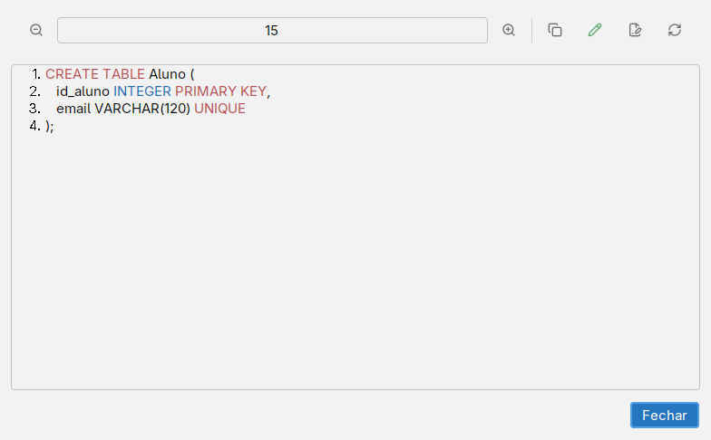

# Gerar SQL (DDL)

DDL descreve a estrutura do banco, por exemplo `CREATE TABLE` e restrições de chave. O brModelo gera texto a partir do modelo lógico. Esse texto é uma proposta para revisão e execução no ambiente do seu SGBD.

## Como gerar

1. Ative um diagrama **Lógico** e confira os nomes e os tipos dos campos.
2. Escolha **Diagrama → Converter para físico**.
3. A janela **Exibição de modelo físico** apresenta o código. Use suas opções para copiar ou salvar o texto.
4. Para inspecionar uma tabela durante o desenho, use **Mostrar DDL** no Inspector. As opções **SQL/DDL** do diagrama incluem separador SQL e prefixo dos nomes.

A captura usa um pequeno trecho didático no visualizador. O texto produzido para seu modelo depende das tabelas, tipos, complementos e IRs configurados.

## O que revisar antes de executar

1. **SGBD e tipos:** tamanhos de texto, precisão de números, datas e palavras reservadas. O editor aceita tipos escritos pelo usuário; isso não garante que o banco os aceite.
2. **Identificação:** PK em cada tabela que precisa de identificação, composição e ordem dos campos. UNIQUE deve corresponder à regra do domínio.
3. **Referências:** tabelas e campos apontados por cada FK, tipos compatíveis e ordem nas chaves compostas.
4. **Ausência de valores:** confira nulabilidade e obrigatoriedade. Uma participação mínima no modelo conceitual pode exigir uma regra que uma FK sozinha não garante.
5. **Nomes e complementos:** prefixos, caracteres especiais e cláusulas escritas manualmente. Recursos como geração automática de valores precisam ser ajustados ao banco escolhido.
6. **Regras restantes:** especializações, limites de cardinalidade e outras condições podem exigir restrições adicionais ou lógica da aplicação.

Execute primeiro em um banco de teste, usando as ferramentas do SGBD. O comando de geração não cria uma conexão com o banco para aplicar o DDL. Volte ao [modelo lógico](modelo-logico.md) se encontrar um erro de estrutura.
