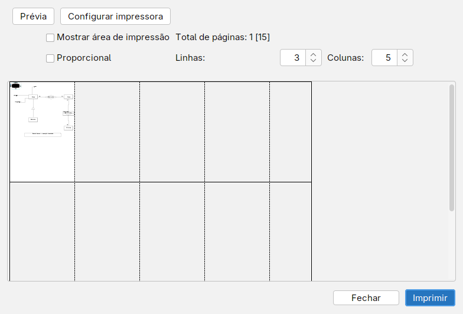
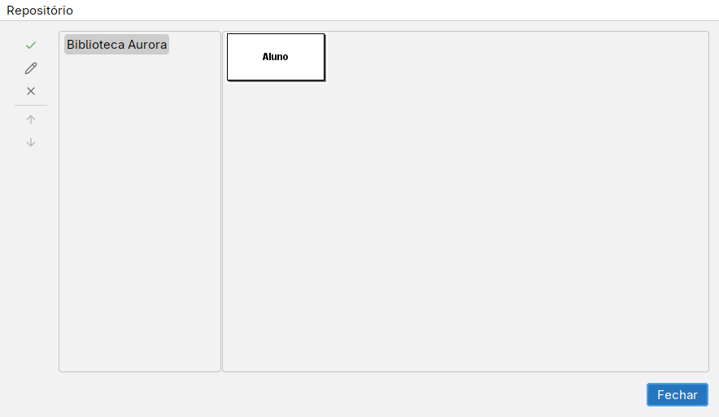

# Imprimir, exportar e reutilizar

## Imprimir

1. Ative o diagrama que deseja imprimir.
2. Escolha **Arquivo → Imprimir…**. Confira o desenho, o total de páginas e os controles **Linhas**, **Colunas** e **Proporcional**. Use **Configurar impressora** para as opções da impressora.
3. Observe o número de páginas: uma folha grande pode ocupar várias páginas impressas. Ajuste Linhas/Colunas ou a opção Proporcional e confira a legibilidade em **Prévia**.
4. Use **Imprimir** para escolher a impressora e confirmar o trabalho.

## Exportar imagem

1. Ative o diagrama e escolha **Arquivo → Exportar…**.
2. Escolha o destino e o formato de imagem oferecido no seletor.
3. Abra a imagem gerada e confira se todos os objetos e textos aparecem. Use a imagem em um relatório, mas guarde também o `.brM3` ou `.brMj` para continuar editando.

**Editar → Copiar como imagem** coloca uma imagem na área de transferência. Isso é diferente de **Copiar**, que preserva os objetos para colagem no editor.

## Copiar e colar objetos

1. Selecione os objetos no desenho; **Editar → Selecionar Tudo** seleciona o diagrama.
2. Use **Editar → Copiar** ou **Recortar**.
3. Ative um diagrama de tipo compatível e use **Editar → Colar**. Ajuste a posição dos objetos e confira as ligações.

**Copiar formatação** e **Colar formatação** permitem reaproveitar a apresentação de um objeto. Veja os [atalhos reais](atalhos.md); Ctrl+T é Selecionar Tudo nesta versão.

## Partes prontas

O menu chama esse recurso de **Repositório**. Ele guarda trechos reutilizáveis, não um arquivo de diagrama inteiro.

1. Selecione no desenho o trecho que deseja guardar.
2. Escolha **Repositório → Adicionar seleção** e informe uma descrição.
3. Use **Repositório → Exibir repositório** para ver os trechos do tipo de diagrama atual.
4. Selecione uma parte e use o botão com a dica **Copiar para o diagrama**. Confira o resultado e sua posição.
5. Use **Repositório → Salvar repositório** para preservar as alterações no arquivo `Template.brMt`.

Esse arquivo fica na pasta de dados do NG, descrita em [Primeiros passos](primeiros-passos.md#onde-ficam-as-preferências). Os botões também permitem editar a descrição, excluir e reordenar as partes.
