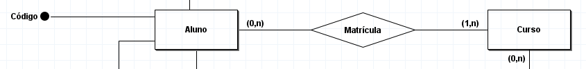
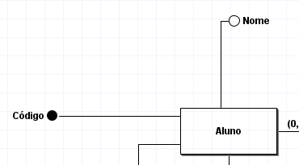
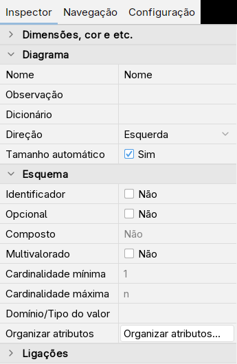
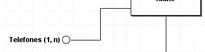
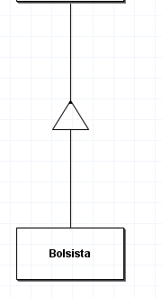
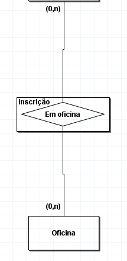
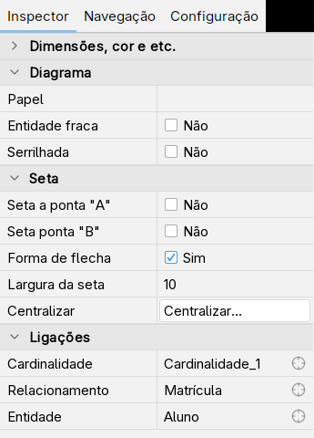

# Modelo conceitual

Um modelo entidade-relacionamento (ER) descreve informações e regras do domínio, antes da escolha de tabelas e tipos SQL. Pergunte quais objetos existem, como são identificados e como se relacionam. As cardinalidades devem refletir regras confirmadas, não apenas os dados de um exemplo.

Crie o diagrama em **Arquivo → Novo → Conceitual**. Os nomes abaixo são os nomes das ferramentas ou propriedades reais; as dicas dos botões ajudam a encontrá-las.

## Entidades e relacionamentos

Uma entidade representa um conjunto de objetos distinguíveis, como Aluno ou Curso. Um relacionamento representa associações entre ocorrências desses conjuntos, como a matrícula de um aluno em um curso. Ele também pode ter atributos, como a data da matrícula.

1. Escolha **Nova Entidade** na paleta e clique na folha. Repita para a outra entidade.
2. Selecione cada retângulo e altere **Nome** no Inspector para dar nomes significativos.
3. Escolha **Novo Relacionamento**, clique na folha e nomeie o losango.
4. Com **Nova Ligação**, clique na entidade e no relacionamento. Repita para cada participante. Um atalho de desenho é ligar diretamente duas entidades: a ferramenta cria o relacionamento entre elas.

## Atributos simples e identificadores

Um atributo simples registra uma propriedade sem decomposição relevante para o modelo, como Nome. Um identificador distingue cada ocorrência da entidade. Um identificador composto pode precisar de mais de um atributo; seus valores em conjunto devem ser únicos.

1. Escolha **Novo Atributo** e clique na entidade ou no relacionamento ao qual pertence. O programa cria o atributo com a ligação.
2. Selecione o atributo e altere **Nome**.
3. Para marcar um identificador, mude **Identificador** para **Sim** no Inspector. O símbolo fica preenchido. Um identificador não pode ser opcional; ao marcá-lo, o programa desmarca a opção correspondente.

## Atributos compostos

Um atributo composto reúne componentes com significado próprio: Endereço pode ser decomposto em Rua, Número e Cidade. Só decomponha se o domínio precisar desses componentes separadamente.

1. Crie o atributo principal com **Novo Atributo**.
2. Com a mesma ferramenta, clique no atributo principal para criar um componente ligado a ele; repita para os demais.
3. Selecione o principal. **Composto** é uma indicação calculada a partir das ligações, apenas para leitura; não é uma caixa para ativar manualmente.

A captura do Inspector de um atributo do fixture mostra a propriedade **Composto** e as demais opções. O fixture original não contém um endereço composto.

## Multivalorados e opcionais

Um atributo multivalorado admite vários valores para a mesma ocorrência, como Telefones de Aluno. Um atributo opcional pode não ter valor informado. São decisões diferentes: permitir ausência não significa permitir vários valores.

1. Crie ou selecione um atributo e marque **Multivalorado** no Inspector. Ajuste **Cardinalidade mínima** e **Cardinalidade máxima**; o programa aceita `n` como limite máximo sem número fixo.
2. A ferramenta **Novo Atributo Multivalorado** também cria uma estrutura com componentes. Use atributos filhos apenas quando os valores tiverem composição relevante.
3. Para um atributo simples que pode faltar, marque **Opcional**. Em multivalorados, represente a possibilidade de ausência pela cardinalidade mínima **0**.

No [modelo lógico](modelo-logico.md), um multivalorado normalmente exige uma tabela própria: não transforme vários telefones em um único texto separado por vírgulas.

## Cardinalidades

A cardinalidade mínima expressa participação obrigatória (**1**) ou opcional (**0**). A máxima indica uma ocorrência (**1**) ou várias (**n**). O brModelo oferece **(0,1)**, **(1,1)**, **(0,n)** e **(1,n)** nas ligações entre entidade e relacionamento.

1. Selecione o texto da cardinalidade junto à entidade.
2. Altere **Cardinalidade** no Inspector.
3. Para distinguir participantes, selecione a ligação e preencha **Papel**, quando necessário.

Leia o par junto de uma entidade como a quantidade de ocorrências do relacionamento em que **uma ocorrência dessa entidade** pode participar. No exemplo, `(0,n)` junto a Aluno permite um aluno sem matrícula ou com várias; `(1,n)` junto a Curso exige que cada curso tenha ao menos uma matrícula. Confira se essa exigência faz sentido no seu domínio.

## Auto-relacionamento

Um auto-relacionamento liga ocorrências da mesma entidade em papéis distintos: uma pessoa pode supervisionar outras pessoas. A entidade aparece uma vez, com duas ligações ao relacionamento.

1. Escolha **Novo Auto Relacionamento** e clique sobre a entidade.
2. Nomeie o relacionamento.
3. Ajuste as duas cardinalidades e os **Papéis** das ligações, por exemplo Supervisor e Supervisionado. Não confunda os limites de cada papel.

A paleta abaixo mostra a ferramenta; o fixture da Escola Aurora não contém um auto-relacionamento.

## Especialização e generalização

A especialização separa subconjuntos de uma entidade genérica; generalizar é reconhecer o conjunto comum a partir dos subconjuntos. Os subtipos herdam a identificação e as propriedades do supertipo.

**Total**: toda ocorrência do supertipo pertence a algum subtipo. **Parcial**: algumas podem não pertencer. **Exclusiva**: uma ocorrência pertence a no máximo um dos subtipos. **Compartilhada**, chamada **não exclusiva** no programa: uma ocorrência pode pertencer a mais de um. Totalidade e exclusividade são critérios independentes.

1. Para a estrutura exclusiva, escolha **Nova Especialização (exclusiva)** e clique na entidade genérica. Ela cria um triângulo e uma entidade especializada.
2. Para a estrutura não exclusiva, escolha **Nova Especialização (duas entidades)** sobre a entidade genérica. O programa cria ramos com triângulos separados.
3. Selecione o triângulo e ajuste **Esp. parcial** ou **Esp. total**. **Esp. exclusiva** e **Esp. não exclusiva** são indicações calculadas da estrutura, apenas para leitura.
4. Nomeie os subtipos e confira as ligações. **Nova Especialização** cria apenas o triângulo; você precisa ligá-lo corretamente antes de usá-lo. A indicação **Mal formatada** pede revisão dessas ligações.

O desenho do fixture é um exercício de ferramenta. Para um domínio em que nem todo aluno é bolsista, essa especialização deveria ser **parcial**, mesmo que a captura mostre a propriedade total usada no teste. Não copie a regra sem conferir seu significado.

## Entidade associativa

Use uma entidade associativa quando uma associação também precisa participar de outro relacionamento. Ela mantém o significado de relacionamento e permite tratá-lo como participante de uma associação adicional.

1. Escolha **Nova Entidade Associativa** e clique na folha.
2. Nomeie a entidade e o relacionamento interno, selecionando cada parte no Inspector.
3. Com **Nova Ligação**, ligue os participantes ao relacionamento interno; uma ligação à parte externa permite que a associação participe de outro relacionamento.

Há também comandos no Inspector para converter um relacionamento em entidade associativa e para realizar o caminho inverso. Confira os participantes e os atributos após a transformação.

## Entidade fraca

Uma entidade fraca depende de uma entidade proprietária para sua identificação: um item de pedido, por exemplo, pode ser identificado pelo pedido e pelo número do item dentro dele. A dependência de identificação exige uma regra mais forte que simplesmente ter uma chave estrangeira.

1. Desenhe a entidade proprietária, a dependente e o relacionamento entre elas.
2. Selecione a **ligação** entre a entidade dependente e o relacionamento.
3. No Inspector, marque **Entidade fraca**. O programa representa essa ligação por uma linha dupla. Ajuste também identificadores e cardinalidades coerentes com o domínio.

No brModelo essa marca é uma propriedade da ligação; não há uma ferramenta separada de entidade fraca na paleta. O Inspector abaixo mostra a opção sobre uma ligação do fixture, sem transformar a Escola Aurora num exemplo de dependência.

Antes de [converter para lógico](modelo-logico.md#converter-do-conceitual), revise os identificadores, as participações e as estruturas de especialização. O conversor ajuda no mapeamento, mas não confirma suas regras de negócio.
