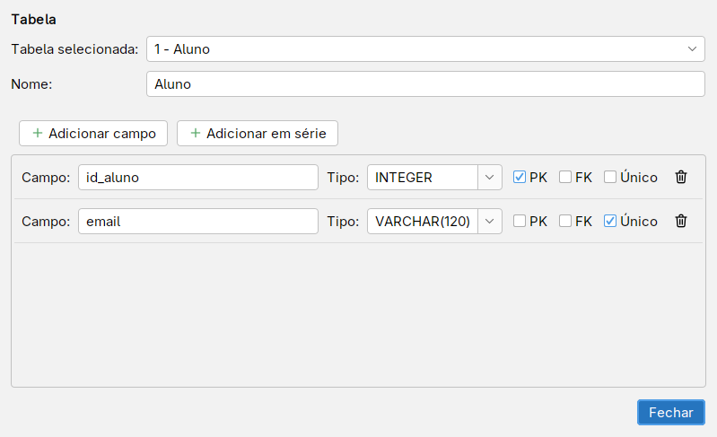
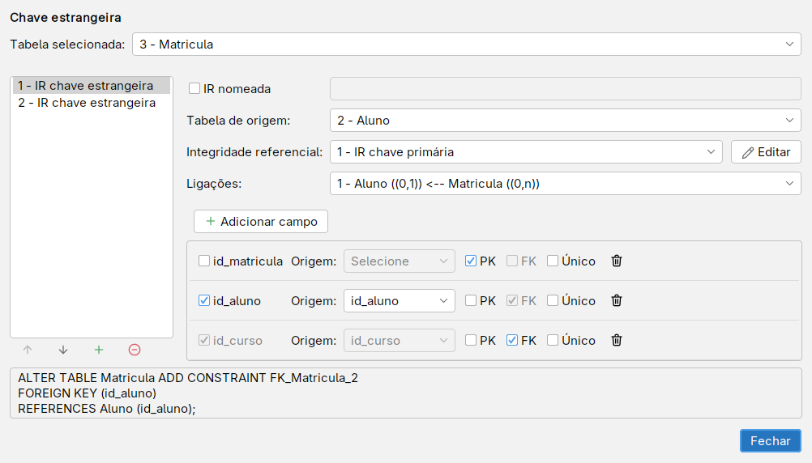
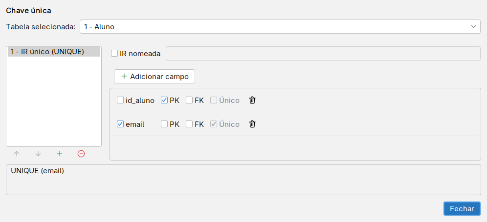
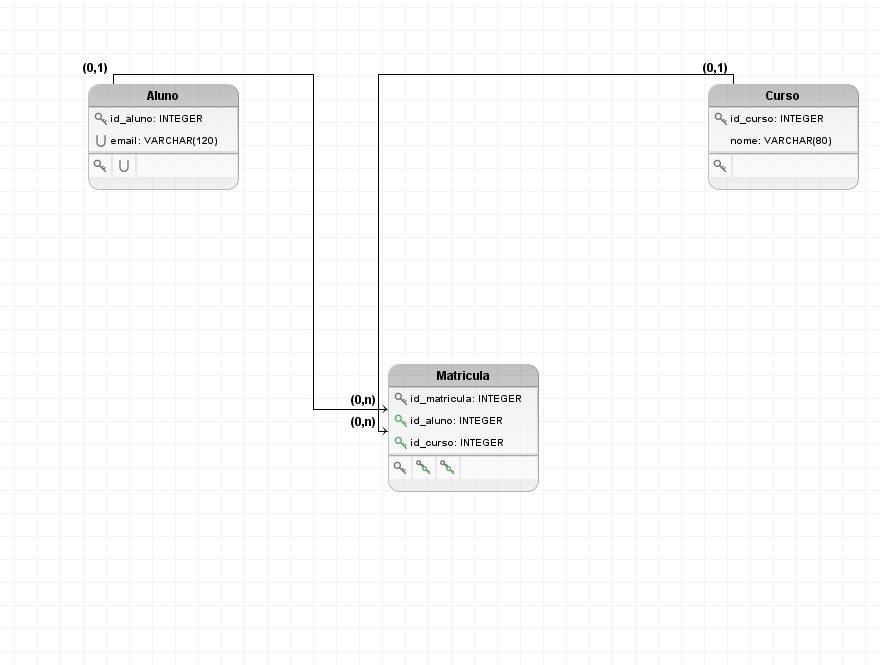

# Modelo lógico

O modelo lógico organiza o domínio em tabelas, campos e restrições. Uma chave primária (PK) identifica cada linha; uma chave estrangeira (FK) referencia uma chave de outra tabela ou da própria tabela. Uma restrição UNIQUE evita repetição de um campo ou de uma combinação de campos.

## Tabelas, campos e tipos

1. Escolha **Arquivo → Novo → Lógico** e use **Nova Tabela** na paleta.
2. Nomeie a tabela pelo **Nome** no Inspector.
3. Use uma ferramenta de **Novo Campo** e clique sobre a tabela. As variantes da paleta têm dicas para campo comum, chave primária, chave estrangeira e chave primária/estrangeira.
4. Selecione o campo, nomeie-o e ajuste **Tipo de campo**. Por exemplo, `INTEGER` ou `VARCHAR(120)`. Os tipos são textos do modelo; confira a sintaxe no SGBD que você usará.
5. Para editar vários campos, use **Diagrama → Editar campos**. **Diagrama → Editar tipos** agrupa a edição dos tipos.

## PK, FK e UNIQUE

Uma PK pode reunir vários campos; uma FK composta precisa preservar a correspondência e a ordem dos campos da chave referenciada. Use os editores de IR para conferir essas estruturas. O programa chama esses grupos de restrições de **IR**, incluindo PK e UNIQUE, além da integridade referencial das FKs.

1. Selecione a tabela e procure no Inspector **IR chave primária**, **IR chave estrangeira** e **IR único (UNIQUE)**. Eles abrem os editores correspondentes.
2. Para criar uma ligação entre tabelas, escolha **Novo Relacionamento** e clique primeiro no campo PK ou UNIQUE da tabela referenciada, depois no campo da tabela que terá a FK. Se o segundo clique atingir apenas a tabela, a ferramenta pode criar o campo de destino.
3. No editor **IR chave estrangeira**, confira as tabelas de origem/destino e os pares de campos. Os botões permitem adicionar, remover e reordenar entradas. Confira também as opções de nome da IR.
4. Use **Único** para uma restrição de campo único; para combinações, confira o grupo no editor de UNIQUE. Marcar FK em um campo, isoladamente, não substitui definir sua referência.

## Converter do conceitual

1. Ative a aba do modelo conceitual.
2. Escolha **Diagrama → Converter para lógico**. O programa abre um novo diagrama lógico e usa o conceitual como origem.
3. Na primeira pergunta, escolha se deseja substituir caracteres especiais dos nomes por `_` ou mantê-los.
4. Leia as perguntas seguintes. Conforme o modelo, elas tratam de atributos compostos/multivalorados, auto-relacionamentos, propagação de chaves nos relacionamentos e estratégias de especialização. Nem toda pergunta aparece em todo modelo.
5. Ao terminar, revise as tabelas, campos, PKs, FKs e restrições no novo diagrama. Salve-o separadamente.

Um atributo multivalorado pode exigir uma tabela com referência à entidade proprietária. Relacionamentos n:n normalmente originam uma tabela própria. Nos casos em que há alternativas, o conversor pergunta se deve propagar chaves ou criar tabela para o relacionamento.

Para uma hierarquia, o diálogo oferece uma tabela por entidade, uma tabela para a hierarquia inteira e, quando aplicável, tabelas apenas para entidades especializadas. Algumas alternativas ficam desabilitadas pela estrutura. Escolha considerando totalidade, exclusividade, valores ausentes e as restrições que você precisa preservar.

Cancelar durante a conversão não equivale a concluir um modelo lógico válido. Confira o destino antes de guardá-lo. Em especial, verifique a identificação de entidades fracas e os atributos de relacionamentos. Em seguida, avance para [Gerar SQL](gerar-sql.md).
