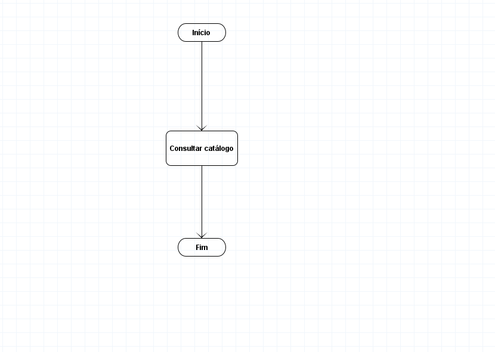
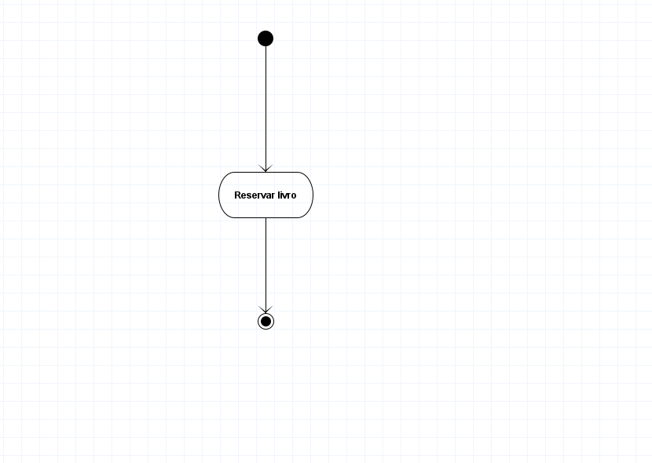
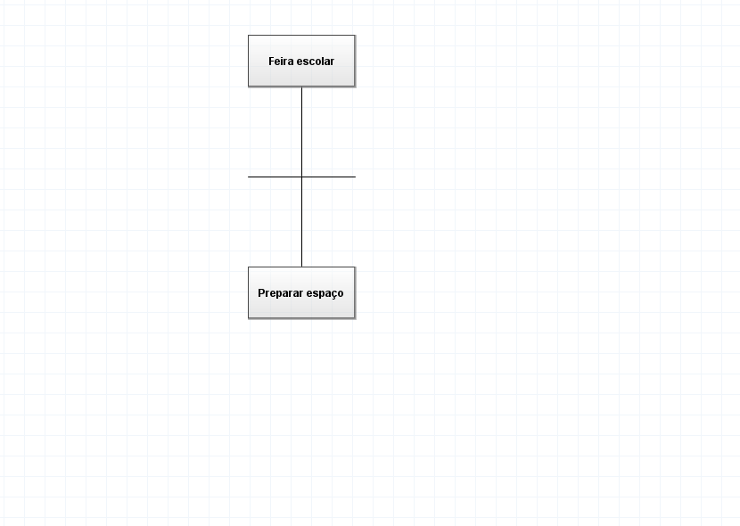
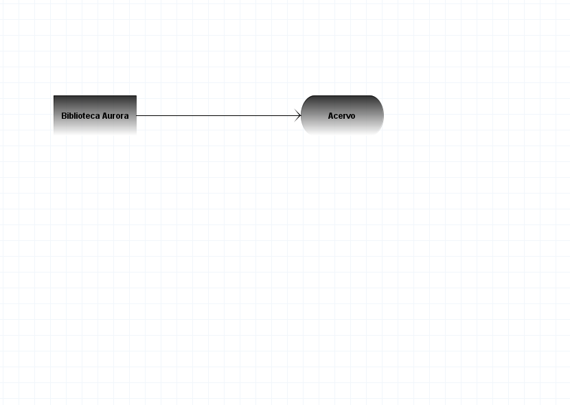

# Outros diagramas

Crie cada tipo em **Arquivo → Novo**. A paleta muda automaticamente. Em todos eles, selecione um objeto para mudar seu texto e suas propriedades no Inspector; use a ferramenta de ligação própria do tipo para conectar os objetos.

## Fluxo

Use **Novo início/fim**, **Novo processo** e **Nova decisão** para representar um procedimento e suas alternativas. A ferramenta de ligação conecta os passos. Nomeie as decisões e indique o significado dos caminhos.

## Atividade

Há ferramentas para início, fim, estados, decisões, raias e junção/divisão de fluxo. Use as raias para separar responsabilidades e os textos de condição para explicar as alternativas. A presença de uma ferramenta não valida automaticamente a semântica do fluxo.

## EAP

Uma estrutura analítica do projeto decompõe o trabalho em partes menores. Use **Novo Processo** e a ligação de EAP para desenhar a hierarquia. O menu **Diagrama → CLI** abre a interface textual disponível para esse tipo.

## Livre

Use retângulos, círculos, losangos, notas, textos e ligações para esquemas sem a semântica de um modelo ER. O desenho livre serve para comunicação visual; não é a entrada do conversor conceitual → lógico.

Veja [Imprimir, exportar e reutilizar](imprimir-exportar.md) para entregar esses desenhos.
