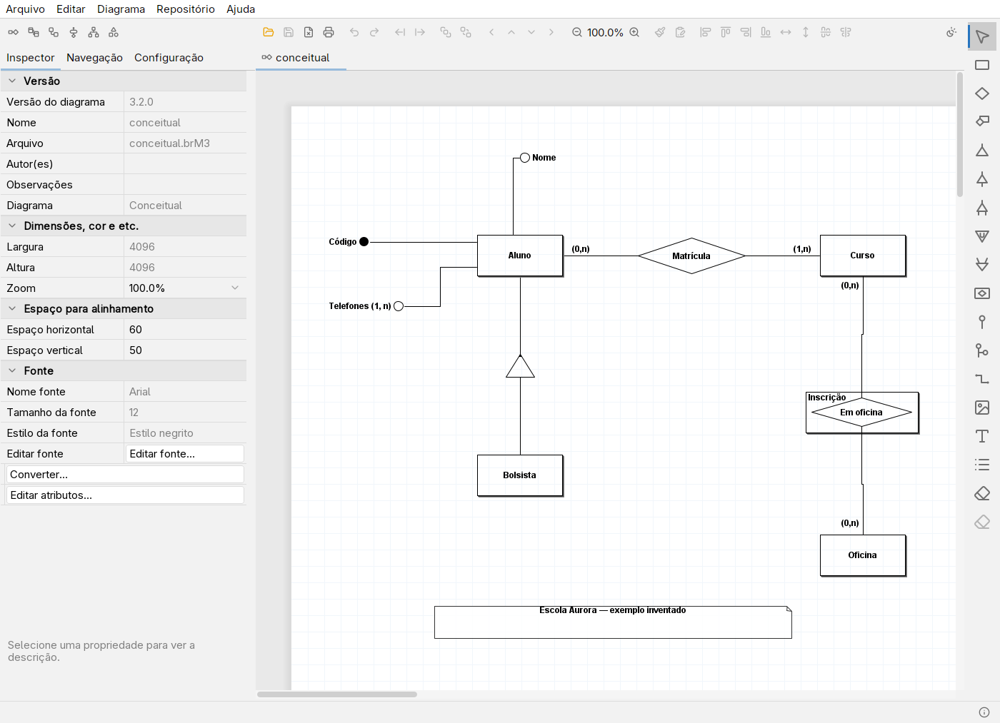
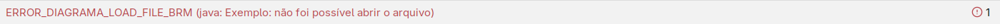

# Primeiros passos

## Conheça a janela

No topo ficam **Arquivo**, **Editar**, **Repositório**, **Diagrama** e **Ajuda**, além da barra de botões. À esquerda, **Inspector** mostra propriedades do objeto selecionado; **Navegação** lista os objetos do diagrama; **Configuração** reúne opções do editor. Arraste os divisores para dar mais espaço aos painéis ou ao desenho.

A paleta de artefatos muda conforme o tipo de diagrama. Passe o mouse sobre um botão para ler sua dica. Escolha uma ferramenta e clique na folha; ferramentas de ligação normalmente pedem um clique em cada objeto. Para voltar à seleção, pressione **Esc**.

As abas identificam os diagramas abertos. A barra de estado mostra mensagens da operação atual. O indicador de log, junto dela, permite abrir a janela de mensagens; erros ainda não lidos recebem destaque.

O botão de tema na barra abre um menu com **Seguir o sistema**, **Claro**, **Escuro** e **Mais temas…**. Em **Editar → Aparência…**, escolha um tema fixo ou siga o sistema com um tema preferido para cada modo. O site de ajuda acompanha o modo claro/escuro do sistema pelo navegador, independentemente do tema do editor.

## Criar, abrir e salvar

1. Escolha **Arquivo → Novo → Conceitual** para começar um modelo de banco de dados. O submenu também oferece Lógico, Fluxo, Atividade, EAP e Livre.
2. Use **Arquivo → Abrir** para carregar um arquivo existente. O menu de arquivos recentes permite reabrir trabalhos já usados.
3. Use **Arquivo → Salvar** para gravar o diagrama atual. Na primeira gravação, escolha a pasta e o nome.
4. Em **Arquivo → Salvar Como…**, escolha o formato no seletor. **Salvar Todos** grava os diagramas abertos; observe os nomes e destinos antes de confirmar.

Os atalhos do programa diferem de vários editores: por exemplo, Abrir é **Ctrl+A** e Salvar é **Ctrl+B**. Consulte [Atalhos](atalhos.md) e os aceleradores exibidos nos menus.

## Qual formato escolher?

- **`.brM3`**: formato binário tradicional. Use ao compartilhar com o brModelo oficial 3.3.2.
- **`.brMj`**: formato JSON do NG, legível como texto e útil para revisar diferenças no Git. O oficial não lê esse formato.

Para mudar de formato, abra no NG e use **Salvar Como…**, selecionando o filtro correspondente. Preserve uma cópia antes de converter. Veja também [compatibilidade e recuperação](problemas-comuns.md).

## Auto-salvamento e recuperação

Na aba **Configuração**, a propriedade **Intervalo** define o auto-salvamento em minutos. O padrão é **5**; **0** desativa. Esse mecanismo grava um arquivo de recuperação dos diagramas alterados; continue usando **Salvar** para gravar os arquivos de trabalho.

Após um encerramento incorreto, o programa pergunta se você deseja restaurar os diagramas não salvos. Aceite a restauração, confira cada aba e use **Salvar Como…** para guardar os trabalhos recuperados. A recuperação cobre o último auto-salvamento concluído, não todas as alterações posteriores.

## Onde ficam as preferências?

No Linux, o NG segue as pastas XDG:

- Preferências: `$XDG_CONFIG_HOME/brmodelo-ng/config.chc`; sem a variável, `~/.config/brmodelo-ng/config.chc`.
- Recuperação: `$XDG_STATE_HOME/brmodelo-ng/autosave.chc`; sem a variável, `~/.local/state/brmodelo-ng/autosave.chc`.
- Partes prontas: `$XDG_DATA_HOME/brmodelo-ng/Template.brMt`; sem a variável, `~/.local/share/brmodelo-ng/Template.brMt`.

No Windows, usa `%LOCALAPPDATA%/brModelo NG`; no macOS, `~/Library/Application Support/brModelo NG`. O Flatpak mantém essas pastas no espaço de dados do aplicativo. Arquivos legados na pasta de execução são copiados na primeira utilização, preservando os originais. Os seus diagramas ficam na pasta escolhida ao salvar.

Para aprender a desenhar, siga para [Modelo conceitual](modelo-conceitual.md).
